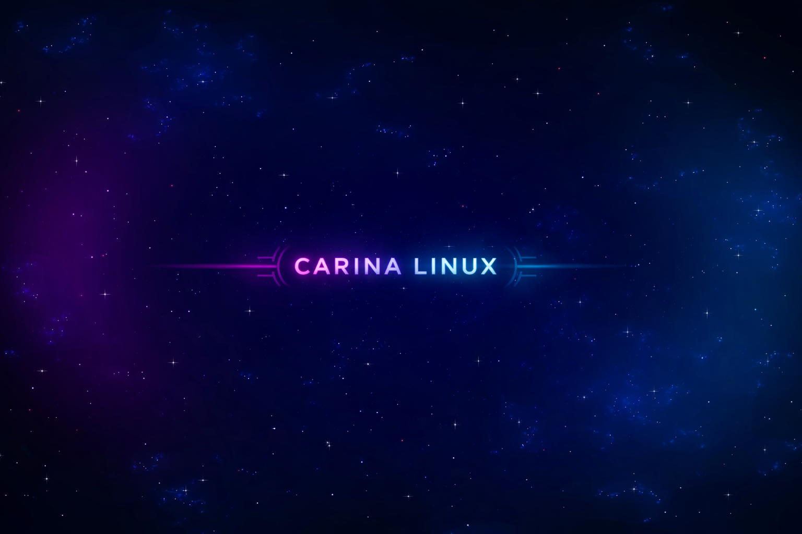

# CARINA OS



**Mission-Grade Linux for STEM, Embedded, and Space-Focused Engineering**

CARINA OS is a Debian-based operating system designed for engineers, scientists, and builders working in STEM, embedded systems, robotics, AI experimentation, and space-adjacent research. Rather than being a general-purpose Linux desktop or a themed remix, CARINA is built as a controlled engineering platform where experimentation, hardware interaction, and system safety are first-class concerns.

The goal of this project is to address long-standing pain points found in many Linux distributions—unsafe testing on the host OS, polluted environments, inconsistent hardware permissions, and ad-hoc tooling installs—by providing intentional system structure, opt-in capabilities, and auditable workflows.

CARINA is designed to run on laptops, Toughbooks, small PCs, and field systems, with optional GUI support and a strong headless-first philosophy.

## Core Design Idea

Instead of treating the operating system as a blank canvas that users must constantly fight and reconfigure, CARINA treats the OS as mission infrastructure:

- The base system stays clean and stable
- Experimentation happens in controlled environments
- Tooling is installed deliberately, not accidentally
- Hardware access "just works" without unsafe permissions
- The system can safely support automation and AI later

CARINA is not trying to replace Ubuntu or Debian — it builds on them responsibly while providing a clear identity and opinionated workflow for engineering use cases.

## How CARINA Works (High Level)

CARINA is structured around capability layers, not monolithic installs:

### 1. CARINA Core

A minimal, hardened base system with:

- Clear OS identity
- Profile-driven configuration
- No forced GUI
- Clean defaults suitable for field or lab use

### 2. CARINA Sandbox

A built-in isolation system that allows users to:

- Spin up disposable execution environments
- Test scripts and tools safely
- Avoid polluting the host OS
- Automatically clean up experiments via TTLs

### 3. CARINA MissionLab

An opt-in capability layer for:

- Embedded development
- Robotics tooling
- Microcontroller workflows
- Hardware and serial device access

Tooling is installed via CARINA-managed commands rather than copy/paste shell snippets.

### 4. FlightDeck (Optional GUI)

A GUI environment that can be enabled or disabled without breaking the system, with desktop integration for CARINA features.

## What This Repo Contains

- CARINA OS bootstrap and system identity logic
- Profile system (Core, FlightDeck, MissionLab)
- CARINA CLI (`carina`) for managing system capabilities
- Built-in sandbox framework (containers, TTL, logging)
- MissionLab install framework (`carina missionlab install …`)
- Mission Manual documentation (ops-style, not blog-style)

## Quick Start

To convert a fresh Ubuntu Server 24.04 into CARINA Core:

```bash
git clone https://github.com/ebarlowjr2/carina-os.git
cd carina-os
sudo ./bootstrap/bootstrap-carina.sh
```

## CLI Usage

```bash
carina doctor              # Check system health
carina profile list        # List available profiles
carina profile apply core  # Apply a profile
carina gui enable          # Enable graphical interface
carina gui disable         # Disable graphical interface
carina sandbox up python   # Start a Python sandbox
carina missionlab install arduino-cli  # Install Arduino CLI
carina version             # Show version
```

## Why This Project Exists

Many Linux distributions are powerful, but they often assume:

- Users are comfortable testing directly on the host
- Hardware permissions will be manually fixed
- Environments can be broken and rebuilt freely

CARINA assumes the opposite:

- Experimentation should be isolated
- Systems should remain clean
- Hardware should work without unsafe shortcuts
- Automation and AI must operate within guardrails

This makes CARINA suitable for education, research, prototyping, and mission-oriented engineering.

## Project Status

CARINA is under active development. The architecture is real, tested, and evolving.

This is not a toy project, but it is also not "finished." Design decisions prioritize clarity, safety, and extensibility.

## Who Should Contribute

We're interested in collaborators who care about:

- Linux internals and distro engineering
- Embedded systems and robotics
- Safe experimentation environments
- Developer experience for technical users
- Documentation that reads like an ops manual
- Long-term maintainability over hype

You don't need to be a space engineer — just someone who wants Linux to behave better for people who build things.

## Philosophy Note

Changes should be understandable, reviewable, and reversible.

CARINA is meant to be boring in the right places and powerful where it matters.

## Requirements

- Ubuntu Server 24.04 LTS
- Root/sudo access
- Network connectivity

## License

Proprietary - CARINA OS
